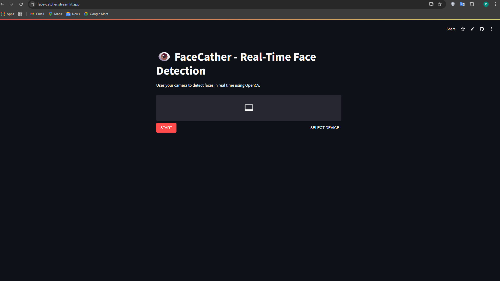

# 👁️ FaceCather — Real-Time Face Detection with Streamlit & OpenCV


**FaceCather** is a real-time face detection web application built using **Streamlit**, **OpenCV**, and **WebRTC**. It leverages your webcam to detect faces live, featuring a smooth UI, responsive video stream, and fast detection using Haarcascade classifiers.

---

## 🚀 Live Demo

👉 [**View Live Demo**](https://face-catcher.streamlit.app/)

---

## 🌟 Features

- 📸 **Live Face Detection**: Real-time detection via your device camera.
- 🧠 **OpenCV + Haarcascade**: Efficient face recognition using classic computer vision.
- ⚙️ **WebRTC Streaming**: Seamless webcam integration with low-latency stream.
- 🎨 **Minimal UI**: Clean, dark-themed layout with responsive design.
- 🛑 **Stop Button**: Instantly terminate video stream when needed.

---

## 🛠️ Tech Stack

**Backend**:
- Python
- Streamlit
- OpenCV
- Streamlit WebRTC

**Frontend**:
- HTML5, CSS3
- Bootstrap 5
- Font Awesome

**Development Tools**:
- Git & GitHub
- VS Code / Streamlit Cloud / Hugging Face Spaces

---

## 📁 Project Structure

```
FaceCatcher/
├── app.py
├── requirements.txt
├── assets/
│   ├── cover_image.png
│   └── screenshot_1.png
└── README.md
```

---

## 🚀 Getting Started

```bash
git clone https://github.com/khanfaisal79960/FaceCather.git
cd FaceCather
python -m venv venv
source venv/bin/activate  # or .\venv\Scripts\activate on Windows
pip install -r requirements.txt
streamlit run app.py
```

Open your browser at: [http://localhost:8501](http://localhost:8501)

---

| Home Page |
|-----------|
|  |

---

## ⚙️ How It Works

1. Open the app and allow camera access.
2. Face detection will begin automatically.
3. Bounding boxes are drawn around detected faces in real-time.
4. Use the **STOP** button to stop streaming at any time.

---

## 🧠 Face Detection Logic

- Uses OpenCV's `haarcascade_frontalface_default.xml`.
- Captures frames via WebRTC stream.
- Detects and draws rectangles over faces.
- Runs inside a custom `VideoTransformer` for Streamlit WebRTC.

---

## 🤝 Contributing

Feel free to fork this repository, open issues, or submit pull requests. Contributions are welcome!

---

## 🙋‍♂️ Author

**Faisal Khan**  
- 🌐 [Portfolio](https://khanfaisal.netlify.app)  
- 💼 [LinkedIn](https://www.linkedin.com/in/khanfaisal79960)  
- ✍️ [Medium](https://medium.com/@khanfaisal79960)  
- 📸 [Instagram](https://instagram.com/mr._perfect_1004)  
- 💻 [GitHub](https://github.com/khanfaisal79960)  

---
